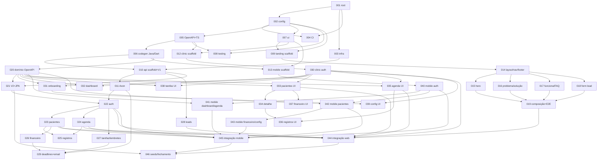

# PsiOps — Grafo de dependências das 46 tarefas

> Revisado em 2026-07-05 após o pivô de stack (ADRs 0007–0009): backend Spring+Axon,
> mobile Flutter no MVP, contratos OpenAPI-first. A contagem passou de 40 para 46.

Fonte da verdade do sequenciamento. Cada tarefa tem manifesto em `tasks/PSI-0NN.yaml`
e produz **no máximo um pull request**. `S` = `shared_change: true`
(altera arquivos compartilhados; **apenas uma em execução por vez**).

## Tabela

| ID | Título | Projeto | S | Depende de |
|---|---|---|---|---|
| PSI-001 | Bootstrap do monorepo (pnpm + Turborepo) | root | S | — |
| PSI-002 | packages/config: configurações compartilhadas | config | S | 001 |
| PSI-003 | Infra local Docker Compose (Postgres + Mailpit) | infra |  | 001 |
| PSI-004 | CI GitHub Actions (js, api, mobile, scope) | infra | S | 001, 002 |
| PSI-005 | contracts: OpenAPI base + codegen TS | contracts | S | 002 |
| PSI-006 | contracts: codegen Java e Dart | contracts | S | 005 |
| PSI-007 | packages/ui: tokens (+ tokens.json Flutter) | ui | S | 002 |
| PSI-008 | packages/testing: fixtures e utilitários | testing | S | 002, 005 |
| PSI-009 | apps/landing: scaffold Next.js | landing | S | 002, 007 |
| PSI-010 | apps/api: scaffold Spring Boot 3 + Flyway V1 | api | S | 003, 006 |
| PSI-011 | api: fundação Axon Framework | api |  | 010 |
| PSI-012 | apps/clinic: scaffold Vite + React + Mantine | clinic | S | 005, 007 |
| PSI-013 | apps/mobile: scaffold Flutter | mobile |  | 006, 007 |
| PSI-014 | landing: layout base, navegação e rodapé | landing |  | 009 |
| PSI-015 | landing: hero com mockup de dashboard | landing |  | 014 |
| PSI-016 | landing: seções problema e solução | landing |  | 014 |
| PSI-017 | landing: como funciona, citação e FAQ | landing |  | 014 |
| PSI-018 | landing: formulário de lista de espera | landing |  | 014 |
| PSI-019 | landing: CTA final, reveal, composição e E2E | landing |  | 015–018 |
| PSI-020 | contracts: domínio clínico completo e eventos | contracts | S | 006 |
| PSI-021 | api: migration V2 e entidades JPA do domínio | api | S | 010, 020 |
| PSI-022 | api: autenticação e autorização | api |  | 011, 021 |
| PSI-023 | api: módulo de pacientes | api |  | 022 |
| PSI-024 | api: módulo de agenda | api |  | 022 |
| PSI-025 | api: registros administrativos de consulta | api |  | 023, 024 |
| PSI-026 | api: módulo financeiro (mensalidades) | api |  | 023 |
| PSI-027 | api: tarefas e lembretes | api |  | 022 |
| PSI-028 | api: captura de leads (lista de espera) | api |  | 010 |
| PSI-029 | api: lembretes assíncronos e e-mail (Axon) | api |  | 011, 026, 027 |
| PSI-030 | clinic: autenticação e sessão | clinic |  | 012 |
| PSI-031 | clinic: onboarding | clinic |  | 030, 020 |
| PSI-032 | clinic: dashboard | clinic |  | 030, 020 |
| PSI-033 | clinic: pacientes (lista e cadastro) | clinic |  | 030, 020 |
| PSI-034 | clinic: detalhe e histórico do paciente | clinic |  | 033 |
| PSI-035 | clinic: agenda e consultas | clinic |  | 030, 020 |
| PSI-036 | clinic: registros administrativos | clinic |  | 034, 035 |
| PSI-037 | clinic: organização financeira | clinic |  | 033 |
| PSI-038 | clinic: tarefas e lembretes | clinic |  | 030, 020 |
| PSI-039 | clinic: configurações | clinic |  | 030, 031 |
| PSI-040 | mobile: autenticação e shell do app | mobile |  | 013 |
| PSI-041 | mobile: dashboard do dia e agenda | mobile |  | 040, 020 |
| PSI-042 | mobile: pacientes | mobile |  | 040, 020 |
| PSI-043 | mobile: financeiro e configurações | mobile |  | 042 |
| PSI-044 | Integração web real e E2E dos fluxos principais | integration |  | 019, 022, 023, 024, 028, 030, 033, 035 |
| PSI-045 | Integração mobile real (integration_test) | mobile |  | 040–043, 022, 023, 024 |
| PSI-046 | Seeds, fixtures e fechamento do MVP | api | S | 021, 044, 045 |

## Grafo

## Estratégia de execução em ondas

Tarefas `S` executam **uma por vez** (serializa lockfile, contracts, workflows e
migrations Flyway). As demais rodam em paralelo, cada agente em seu worktree
(`scripts/create-worktree.sh PSI-0NN`).

| Onda | Tarefas | Paralelismo |
|---|---|---|
| **0 — Governança** | docs, ADRs, CLAUDE.md, manifestos, scripts (pré-tarefas) | orquestrador |
| **1 — Fundação** | 001 → 002 → {003 ∥ trem S: 004, 005, 006, 007, 008} | 003 fora do trem S |
| **2 — Scaffolds** | trem S: 009 → 010 → 012 · em paralelo (não-S): 011 (após 010), 013 (após 006+007) | médio |
| **3 — Landing + contratos de domínio** | {014 → 015 ∥ 016 ∥ 017 ∥ 018 → 019} ∥ {020 → 021 em série S} ∥ 028 | alto |
| **4 — API ∥ Clinic ∥ Mobile** | API: 022 → {023 ∥ 024 ∥ 027} → {025 ∥ 026} → 029 · Clinic: 030 → {031 ∥ 032 ∥ 033 ∥ 035 ∥ 038} → {034 ∥ 037 ∥ 039} → 036 · Mobile: 040 → {041 ∥ 042} → 043 | máximo |
| **5 — Integração** | 044 ∥ 045 → 046 (S) | médio |

**Caminho crítico**: 001 → 002 → 005 → 006 → 010 → 020 → 021 → 022 → 023 → 026 → 029 → 044/045 → 046.

### Regras de despacho

1. Uma tarefa só é despachada quando **todas** as dependências tiverem PR aprovado
   e integrado à `main`.
2. Nunca duas tarefas S simultâneas; entre tarefas S, priorizar o caminho crítico.
3. Agentes de uma mesma onda não compartilham caminhos (`allowed_paths` disjuntos).
   Exceção controlada: tarefas de api tocam `apps/api/**` em módulos distintos —
   despachar em paralelo apenas quando os módulos não colidirem (023 ∥ 024 ∥ 027 ok;
   qualquer conflito real aparece no merge e é replanejado).
4. Migrations Flyway: somente PSI-010 (V1), PSI-021 (V2) e PSI-046 (seeds por perfil,
   sem migration) são designadas; nenhuma altera migration anterior.
