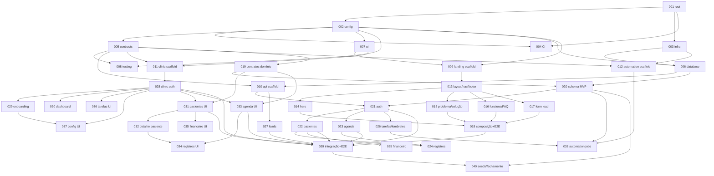

# PsiOps — Grafo de dependências das 40 tarefas

Fonte da verdade do sequenciamento. Cada tarefa tem manifesto em `tasks/PSI-0NN.yaml`
e produz **no máximo um pull request**. `S` = `shared_change: true`
(altera arquivos compartilhados; **apenas uma em execução por vez**).

## Tabela

| ID | Título | Projeto | S | Depende de |
|---|---|---|---|---|
| PSI-001 | Bootstrap do monorepo (pnpm + Turborepo) | root | S | — |
| PSI-002 | packages/config: configurações compartilhadas | config | S | 001 |
| PSI-003 | Infraestrutura local com Docker Compose | infra |  | 001 |
| PSI-004 | CI com GitHub Actions | infra | S | 001, 002 |
| PSI-005 | packages/contracts: fundação de contratos Zod | contracts | S | 002 |
| PSI-006 | packages/database: Prisma e schema inicial | database | S | 002, 003 |
| PSI-007 | packages/ui: tokens de design e primitivas | ui | S | 002 |
| PSI-008 | packages/testing: fixtures e utilitários | testing | S | 002, 005 |
| PSI-009 | apps/landing: scaffold Next.js | landing | S | 002, 007 |
| PSI-010 | apps/api: scaffold NestJS | api | S | 005, 006 |
| PSI-011 | apps/clinic: scaffold Vite + React + Mantine | clinic | S | 005, 007 |
| PSI-012 | apps/automation: scaffold do worker BullMQ | automation | S | 003, 005 |
| PSI-013 | landing: layout base, navegação e rodapé | landing |  | 009 |
| PSI-014 | landing: hero com mockup de dashboard | landing |  | 013 |
| PSI-015 | landing: seções problema e solução | landing |  | 013 |
| PSI-016 | landing: como funciona, citação e FAQ | landing |  | 013 |
| PSI-017 | landing: formulário de lista de espera | landing |  | 013 |
| PSI-018 | landing: CTA final, reveal, composição e E2E | landing |  | 014–017 |
| PSI-019 | contracts: domínio clínico e eventos | contracts | S | 005 |
| PSI-020 | database: schema MVP e migration 0002 | database | S | 006, 019 |
| PSI-021 | api: autenticação e autorização | api |  | 010, 020 |
| PSI-022 | api: módulo de pacientes | api |  | 021 |
| PSI-023 | api: módulo de agenda | api |  | 021 |
| PSI-024 | api: registros administrativos de consulta | api |  | 022, 023 |
| PSI-025 | api: módulo financeiro (mensalidades) | api |  | 022 |
| PSI-026 | api: tarefas e lembretes | api |  | 021 |
| PSI-027 | api: captura de leads (lista de espera) | api |  | 010 |
| PSI-028 | clinic: autenticação e sessão | clinic |  | 011 |
| PSI-029 | clinic: onboarding | clinic |  | 028 |
| PSI-030 | clinic: dashboard | clinic |  | 028 |
| PSI-031 | clinic: pacientes (lista e cadastro) | clinic |  | 028, 019 |
| PSI-032 | clinic: detalhe e histórico do paciente | clinic |  | 031 |
| PSI-033 | clinic: agenda e consultas | clinic |  | 028, 019 |
| PSI-034 | clinic: registros administrativos | clinic |  | 032, 033 |
| PSI-035 | clinic: organização financeira | clinic |  | 031 |
| PSI-036 | clinic: tarefas e lembretes | clinic |  | 028 |
| PSI-037 | clinic: configurações | clinic |  | 028, 029 |
| PSI-038 | automation: lembretes e envio de e-mail | automation |  | 012, 020, 026 |
| PSI-039 | Integração real e E2E dos fluxos principais | integration |  | 018, 021–023, 027, 028, 031, 033 |
| PSI-040 | Seeds, fixtures e fechamento do MVP | database | S | 020, 039 |

## Grafo

## Estratégia de execução em ondas

Tarefas `shared_change: true` (S) executam **uma por vez** (serializa lockfile,
contracts, database e workflows). As demais rodam em paralelo, cada agente em seu
próprio worktree (`scripts/create-worktree.sh PSI-0NN`).

| Onda | Tarefas | Paralelismo |
|---|---|---|
| **0 — Governança** | docs, ADRs, CLAUDE.md, manifestos, scripts (este commit, pré-tarefas) | orquestrador |
| **1 — Fundação** | 001 → 002 → {003 ∥ (004, 005, 006, 007, 008 em série S)} | 003 em paralelo ao trem S |
| **2 — Scaffolds** | 009 → 010 → 011 → 012 (série S; ordem interna livre) | 1 S por vez |
| **3 — Landing + contratos** | {013 → 014 ∥ 015 ∥ 016 ∥ 017 → 018} ∥ {019 → 020 em série S} ∥ 027* | alto |
| **4 — API ∥ Clinic** | API: 021 → {022 ∥ 023 ∥ 026} → {024 ∥ 025} · Clinic: 028 → {029 ∥ 030 ∥ 031 ∥ 033 ∥ 036 ∥ 037} → {032 ∥ 035} → 034 | máximo |
| **5 — Integração** | 038 ∥ 039 → 040 (S) | médio |

\* PSI-027 depende apenas do scaffold da API (010) e pode adiantar na onda 3.

**Caminho crítico**: 001 → 002 → 005 → 019 → 020 → 021 → 022 → 024/025 → 039 → 040.

### Regras de despacho

1. Uma tarefa só é despachada quando **todas** as dependências tiverem PR aprovado
   e integrado à `main`.
2. Nunca duas tarefas S simultâneas; entre tarefas S, priorizar o caminho crítico.
3. Agentes de uma mesma onda não compartilham caminhos (`allowed_paths` disjuntos);
   qualquer exceção exige nova tarefa ou replanejamento — nunca "empréstimo" de escopo.
4. Migrations: somente PSI-006, PSI-020 e PSI-040 tocam `packages/database`;
   executam em ordem estrita e nenhuma altera migration anterior.
