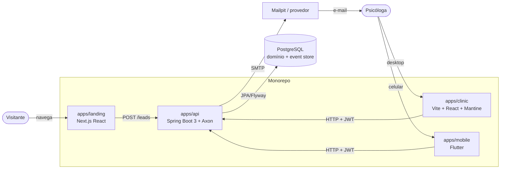

# PsiOps — Contexto do sistema

> Revisado em 2026-07-05 após o pivô de stack (ADRs 0007–0009).

## Visão geral (C4 nível 1–2)

## Aplicações

### apps/landing — Next.js (App Router)
Página pública de marketing, reconstrução fiel de `project/PsiOps Landing.html`.
Tailwind (pipeline própria, preset de tokens do `@psiops/ui`), fontes via `next/font`.
Única escrita: captura de lead via `LeadAdapter` (mock em dev; HTTP para a API na
integração — PSI-044). Sem autenticação, sem acesso a banco.

### apps/clinic — Vite + React + Mantine (web)
SPA autenticada da psicóloga no desktop. Tema Mantine derivado dos tokens de
`@psiops/ui`. Todo acesso a dados passa por **adapters** tipados pelo codegen TS dos
contratos: `Mock*Adapter` (padrão em dev/test) e `Http*Adapter` (API real; PSI-044).
Mocks proibidos em build de produção (verificação automatizada).

### apps/mobile — Flutter
App companion da psicóloga no celular: dashboard do dia, agenda, pacientes e
financeiro. Material 3 tematizado pelo `tokens.json` de `packages/ui`; modelos Dart
gerados dos contratos (`packages/contracts/gen/dart`); mesmo padrão de adapters
mock/HTTP (integração real na PSI-045). Fora do pnpm/turbo; build via Flutter SDK.

### apps/api — Spring Boot 3 + Axon Framework (backend único)
Fonte única de regras de negócio e autorização. Spring Security stateless com JWT
(access + refresh), multi-tenant estrito por `userId` em toda query. DTOs consumidos
de `packages/contracts/gen/java` (nunca redefinidos).

Assincronicidade **dentro do próprio backend** via Axon (não existe worker separado):
- agregados state-stored publicam eventos de domínio;
- event store JPA embutido no PostgreSQL (sem Axon Server no MVP);
- `DeadlineManager` agenda lembretes de consulta (véspera/dia) e a verificação diária
  de cobranças vencidas;
- event handlers fazem projeções e enviam e-mail (SMTP/Mailpit), com idempotência e
  retry — sem regra de negócio própria.

Persistência: JPA/Hibernate + Flyway (`apps/api/src/main/resources/db/migration/`),
migrations sequenciais e imutáveis, `ddl-auto=validate`.

## Pacotes compartilhados

| Pacote | Papel | Quem consome |
|---|---|---|
| `packages/contracts` | Spec OpenAPI 3.1 (fonte única) + codegen comitado: `gen/ts`, `gen/java`, `gen/dart`. | todos os apps |
| `packages/ui` | Tokens de design (CSS vars, objeto TS, tema Mantine, preset Tailwind, `tokens.json` p/ Flutter) e primitivas React. | landing, clinic, mobile (tokens) |
| `packages/config` | tsconfig, ESLint, Prettier, preset Vitest (lado JS). | pacotes/apps JS |
| `packages/testing` | Fixtures determinísticas e infra de mock adapters (lado JS). | landing, clinic |

Regra de dependência: `apps/* → packages/*`, nunca o inverso; apps não importam apps.
Java testa com JUnit/Testcontainers; Flutter com flutter_test/integration_test.

## Infraestrutura local

`docker-compose.yml`: PostgreSQL 16 e Mailpit (sem Redis). Variáveis em `.env.example`.
Toolchains: Node 22 + pnpm, JDK 21 + Maven (wrapper), Flutter 3.32+, Docker.

## CI (GitHub Actions)

Jobs por ecossistema, condicionados à existência dos diretórios:
- **js** — pnpm + `turbo run lint typecheck test build`;
- **api** — JDK 21 + `./mvnw verify` (Testcontainers);
- **mobile** — `flutter analyze && flutter test`;
- **scope** — em branches `agent/*`: `node scripts/validate-task-scope.mjs --task PSI-0NN --base origin/main`.

## Fronteiras de segurança e privacidade

- Landing pública nunca acessa banco diretamente.
- API é a única fronteira de autorização; frontends não contêm regra de acesso.
- Nenhum dado clínico é modelado, transmitido ou armazenado; proibido diagnóstico
  automático ou decisão de saúde por IA.
- Segredos apenas via variáveis de ambiente; nunca comitados (checagem no PR).
