# PsiOps — Contexto do sistema

## Visão geral (C4 nível 1–2)

```mermaid
flowchart LR
    visitante([Visitante]) -->|navega| landing
    psicologa([Psicóloga]) -->|usa| clinic

    subgraph Monorepo
        landing[apps/landing<br/>Next.js]
        clinic[apps/clinic<br/>Vite + React + Mantine]
        api[apps/api<br/>NestJS]
        automation[apps/automation<br/>Node + BullMQ]
    end

    landing -->|POST /leads| api
    clinic -->|HTTP + JWT| api
    api -->|Prisma| pg[(PostgreSQL)]
    api -->|grava eventos| outbox[(tabela Outbox)]
    automation -->|poll| outbox
    automation -->|jobs| redis[(Redis)]
    automation -->|SMTP| mail[Mailpit / provedor]
    mail -->|e-mail| psicologa
```



## Aplicações

### apps/landing — Next.js (App Router)
Página pública de marketing, reconstrução fiel de `project/PsiOps Landing.html`.
Tailwind (pipeline própria, preset de tokens do `@psiops/ui`), fontes via `next/font`.
Única escrita: captura de lead via `LeadAdapter` (mock em dev; HTTP para a API em produção).
Sem autenticação, sem acesso a banco.

### apps/clinic — Vite + React + Mantine
SPA autenticada da psicóloga. Tema Mantine derivado dos tokens de `@psiops/ui`.
Todo acesso a dados passa por **adapters** tipados pelos contratos:
`Mock*Adapter` (memória; padrão em dev/test) e `Http*Adapter` (API real; selecionado por env).
Mocks são proibidos em build de produção (verificação automatizada na PSI-039).

### apps/api — NestJS
Fonte única de regras de negócio e autorização. JWT (access + refresh), guard global,
multi-tenant estrito por `userId` em toda query. Valida entrada/saída com schemas de
`@psiops/contracts`. Persistência exclusivamente via `@psiops/database` (Prisma).
Comunicação com a automation somente pela tabela **Outbox** (a API nunca fala com Redis).

### apps/automation — Node + BullMQ
Worker sem regra de negócio própria: consome a Outbox, agenda/processa jobs no Redis
(lembrete de consulta, cobrança atrasada) e entrega e-mail via SMTP.
Idempotência por `jobId` determinístico; retries com backoff exponencial.

## Pacotes compartilhados

| Pacote | Papel | Quem consome |
|---|---|---|
| `packages/contracts` | Schemas Zod, tipos, eventos de domínio. Fonte única de DTOs. | todos os apps |
| `packages/database` | Schema Prisma, migrations, client singleton, seeds. | api, automation |
| `packages/ui` | Tokens de design (cores, tipografia, sombras), tema Mantine, preset Tailwind, primitivas. | landing, clinic |
| `packages/config` | tsconfig, ESLint, Prettier, preset Vitest. | todos |
| `packages/testing` | Fixtures determinísticas, helpers, infra de mock adapters. | todos |

Regra de dependência (imports permitidos):

```
apps/*  ──►  packages/*          (nunca o inverso)
apps/*  ─X─► apps/*              (proibido)
contracts não importa nada interno; database não importa contracts? — importa apenas contracts
ui, testing ──► contracts, config
```

## Infraestrutura local

`docker-compose.yml`: PostgreSQL 16, Redis 7, Mailpit. Variáveis em `.env.example`.

## CI (GitHub Actions)

Em todo PR: instalação com cache pnpm → `turbo run lint typecheck test build`.
Em branches `agent/*`: validação de escopo de arquivos com
`node scripts/validate-task-scope.mjs --task PSI-0NN --base origin/main`.

## Fronteiras de segurança e privacidade

- Landing pública nunca acessa banco diretamente.
- API é a única fronteira de autorização; frontends não contêm regra de acesso.
- Nenhum dado clínico é modelado, transmitido ou armazenado.
- Segredos apenas via variáveis de ambiente; nunca comitados (checagem no PR).
